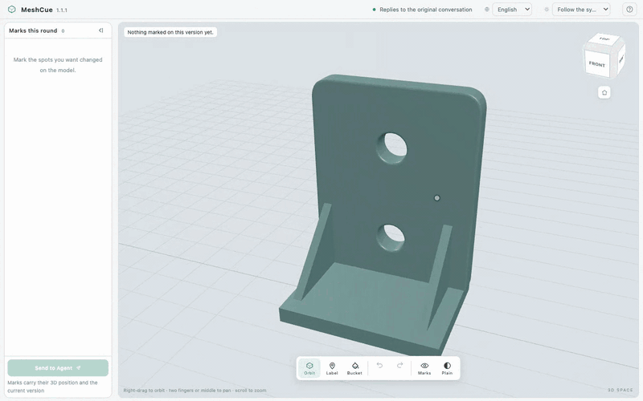

# MeshCue

[](https://github.com/lzyling/meshcue/actions/workflows/ci.yml)
[](LICENSE)

**Point at the model. Let the Agent read what you meant.**



<sub>Recorded from the application by `scripts/record-demo.mjs` — a real server, a
real publish, real Chromium. The Agent on the other end of the last step is the
same test double the suites use; everything the browser does is the product.</sub>

MeshCue is a browser workbench for reviewing 3D models with an AI agent. The
agent publishes a draft, you open it in your own browser, mark the surfaces that
are wrong — lettered pins and painted regions, on the mesh, in three dimensions —
and hand the batch back. The agent reads positions, not a screenshot, and
publishes the next version. Every version stays open for marking.

It is not a CAD or sculpting tool. It is the step between "here is a draft" and
"here is what to change", which until now was a screenshot and a paragraph.

## Why positions

Telling an agent "the fillet on the left bracket is too sharp" costs a sentence
and buys an argument about which bracket. A mark carries the mesh, the face, the
barycentric coordinate and the version it was made against. The agent gets an
address, not a description, and can say back which surface it understood.

## The loop

1. The agent runs `precheck` on the model file, then `open` to publish it.
2. You open the URL in Chrome, Safari or any modern WebGL browser.
3. Pick the label tool and click a surface to drop a lettered pin; the paint
   bucket fills the connected near-flat area around the face you click. The
   orbit tool places nothing, so turning the model never marks it. Nothing is
   submitted until you say so.
4. Press **Send to Agent**. The batch is frozen against the version you marked.
5. The agent calls `read`, replies in your conversation, and `open`s the next
   version. Older versions keep their own marks and stay selectable.

There is no "finish the round" button. The next version _is_ the end of the last
one.

## Three ways in, one implementation

The core does not know which harness is talking to it. All three entry points
drive the same instance manager, with the same actions and the same results.

| Entry point        | How                                                    | Who owns a review                 |
| ------------------ | ------------------------------------------------------ | --------------------------------- |
| OpenClaw extension | native `meshcue` tool                                  | derived from the host's session   |
| `meshcue` CLI      | `meshcue <action> --owner <id> …`, JSON in, JSON out   | stated by the caller              |
| `meshcue-mcp`      | stdio MCP server, added to your client's `mcp_servers` | the workspace, or `MESHCUE_OWNER` |

Ownership decides who may change a draft or switch the displayed version.
A second owner asking about the same project is refused with `RESUME_REQUIRED`
until someone says, explicitly, that the review is being continued.

### Being told, or asking

Only a host that can write into its own conversation can announce a submission.
A client reached over a tool protocol cannot: the protocol has no way to wake a
conversation. MeshCue does not pretend otherwise.

`status.notifier` reports what the host actually offers. Where `send` is false,
a submitted batch has the status `waiting` — durable, listed, collected by
calling `read`. It is not a delivery that failed, it counts as no attempt, and it
never becomes stalled. An agent on such a host should read when the reviewer says
they are done rather than waiting for a message that cannot arrive.

## Model limits

| Limit          | Threshold                        | On exceeding                     |
| -------------- | -------------------------------- | -------------------------------- |
| Triangles      | 600,000                          | publish refused, `MODEL_LIMIT`   |
| File size      | 80 MB                            | publish refused, `MODEL_LIMIT`   |
| Texture pixels | 8192×8192 each, 33,554,432 total | publish refused, `TEXTURE_LIMIT` |

A mark names a source face, so a model at the cap marks exactly as precisely as
a small one — there is no band below these limits where something quietly gets
worse. `precheck` measures a file before `open` and, when it is over, answers
with the ratio to decimate by instead of a refusal after the fact.

A STEP has no face count until it has been tessellated, so `precheck` tessellates
it to measure it — the same tessellation `open` then publishes. Over the cap it
says to simplify the model rather than giving a ratio, because there are no
triangles in the file to decimate: the ones that were counted are ours.

## Running it

Node.js 22 or newer, and a browser with WebGL.

From a clone, for development:

```sh
npm ci
npm run samples      # generate the parametric sample models
npm test             # 232 unit and integration tests
npm run test:browser # 76 real-Chromium tests, isolated port and data
```

Work happens on `dev`; `main` is what has been released, and is only ever
fast-forwarded from `dev` with the tag going on straight afterwards.
[CONTRIBUTING.md](CONTRIBUTING.md) has the whole of it, which is short.

`npm run samples` writes to `tmp/samples` inside the clone, which is where the
suites publish from. A server started from a clone publishes models from the
clone itself and keeps its copies under `runtime/models`; to review files that
live elsewhere, point `REVIEW_WORKSPACE` at the folder that holds them. Cases
that need models this repository does not ship — the LAN case and one
heavy-texture case — skip themselves and say why.

For an OpenClaw install, build and install the extension from that clone:

```sh
npm run build:integration -- tmp/candidate/package
openclaw plugins install ./tmp/candidate/package
```

For any MCP client, install a tagged commit and point the client at it:

```sh
npm i -g "github:lzyling/meshcue#v1.3.0"
```

```toml
[mcp_servers.meshcue]
command = "meshcue-mcp"
```

Or start it without installing, at the cost of a fetch and a build each time:

```toml
[mcp_servers.meshcue]
command = "npx"
args = ["-p", "github:lzyling/meshcue#v1.3.0", "meshcue-mcp"]
```

Pin the tag. Without one, npm takes whatever the default branch holds at that
second and runs the `prepare` script in it. A tag is a name its owner can move,
so every release states the commit it was cut from: check that against
`git rev-parse v1.0.1^{commit}` and you know what you built.

MeshCue is not published on the npm registry, and the names `meshcue`,
`meshcue-mcp` and `@lzyling/meshcue` are not held by this project. **A package
under any of those names is not this project**, whatever it claims. This
repository, pinned to a tag, is the only way in — the install commands above use
npm as the package manager, not as the source.

The workbench listens on the loopback address by default. LAN mode binds one
verified private IPv4 and always requires authorization — see
[SECURITY.md](SECURITY.md) for the trust model, how a browser is admitted, and
how long that lasts.

## Documentation

- [AGENT-INTERFACE.md](AGENT-INTERFACE.md) — the contract an agent implements
- [SECURITY.md](SECURITY.md) — network exposure, browser trust, reporting a flaw
- [docs/zh/](docs/zh/) — design documents, in Chinese: positioning,
  requirements, versioning rules, roadmap

## License

Apache-2.0. See [LICENSE](LICENSE).

STEP support is the one part that is not ours. Reading a STEP means evaluating
its surfaces, which MeshCue does with
[occt-import-js](https://github.com/kovacsv/occt-import-js) — a WebAssembly
build of [Open CASCADE Technology](https://github.com/Open-Cascade-SAS/OCCT).
Both are **LGPL-2.1**, and they stay that way: from a clone or an npm install
the library resolves as an ordinary dependency, and the OpenClaw package carries
it as two unmodified files in `vendor/` with both licence texts beside them,
rather than folded into a bundle. That is deliberate. Replacing it — a different
build, a newer OCCT — is a matter of swapping those two files, and a copy inside
a bundle would be one nobody could swap. Everything MeshCue itself is remains
Apache-2.0.
