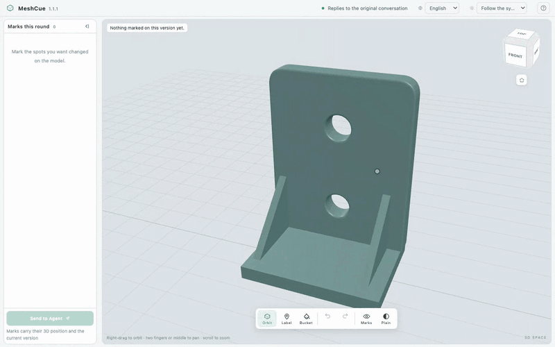

# MeshCue

[](https://github.com/lzyling/meshcue/actions/workflows/ci.yml)
[](LICENSE)

**Point at the model. Let the Agent read what you meant.**

https://github.com/user-attachments/assets/fee043ff-0c6e-4c8c-a6db-f3c21601fae3

<sub>What 1.4 added, in 51 seconds, with sound. It is an animation, rendered from
code with Remotion, and the drone frame in it was made for the film; the
recording below is the application itself. A Chinese cut (中文版) is in the
[announcement](https://github.com/lzyling/meshcue/discussions/10), and the
43-second film from 1.3 in [discussion #9](https://github.com/lzyling/meshcue/discussions/9).</sub>



<sub>Recorded from the application by `scripts/record-demo.mjs` — a real server, a
real publish, real Chromium. The Agent on the other end of the last step is the
same test double the suites use; everything the browser does is the product.</sub>

MeshCue is a browser workbench for reviewing 3D models with an AI agent. The
agent publishes a draft, you open it in your own browser, mark the surfaces that
are wrong — lettered pins and painted regions, on the mesh, in three dimensions —
and hand the batch back. The agent reads positions, not a screenshot, and
publishes the next version. Every version stays open for marking.

It is not a CAD or sculpting tool. It is the step between "here is a draft" and
"here is what to change", which until now was a screenshot and a paragraph.

## Why positions

Telling an agent "the fillet on the left bracket is too sharp" costs a sentence
and buys an argument about which bracket. A mark carries the mesh, the face, the
barycentric coordinate and the version it was made against. The agent gets an
address, not a description, and can say back which surface it understood.

## The loop

1. The agent runs `precheck` on the model file, then `open` to publish it.
2. You open the URL in Chrome, Safari or any modern WebGL browser.
3. Pick the label tool and click a surface to drop a lettered pin; the paint
   bucket fills the connected near-flat area around the face you click. The
   orbit tool places nothing, so turning the model never marks it. Nothing is
   submitted until you say so.
4. Press **Send to Agent**. The batch is frozen against the version you marked.
5. The agent calls `read`, replies in your conversation, and `open`s the next
   version. Older versions keep their own marks and stay selectable.

There is no "finish the round" button. The next version _is_ the end of the last
one.

## Three ways in, one implementation

The core does not know which harness is talking to it. All three entry points
drive the same instance manager, with the same actions and the same results.

| Entry point        | How                                                    | Who owns a review                 |
| ------------------ | ------------------------------------------------------ | --------------------------------- |
| OpenClaw extension | native `meshcue` tool                                  | derived from the host's session   |
| `meshcue` CLI      | `meshcue <action> --owner <id> …`, JSON in, JSON out   | stated by the caller              |
| `meshcue-mcp`      | stdio MCP server, added to your client's `mcp_servers` | the workspace, or `MESHCUE_OWNER` |

Ownership decides who may change a draft or switch the displayed version.
A second owner asking about the same project is refused with `RESUME_REQUIRED`
until someone says, explicitly, that the review is being continued.

### Being told, or asking

Only a host that can write into its own conversation can announce a submission.
A client reached over a tool protocol cannot: the protocol has no way to wake a
conversation. MeshCue does not pretend otherwise.

`status.notifier` reports what the host actually offers. Where `send` is false,
a submitted batch has the status `waiting` — durable, listed, collected by
calling `read`. It is not a delivery that failed, it counts as no attempt, and it
never becomes stalled. An agent on such a host should read when the reviewer says
they are done rather than waiting for a message that cannot arrive.

## Model limits

| Limit          | Threshold                        | On exceeding                     |
| -------------- | -------------------------------- | -------------------------------- |
| Triangles      | 600,000                          | publish refused, `MODEL_LIMIT`   |
| File size      | 80 MB                            | publish refused, `MODEL_LIMIT`   |
| Textures | 8192×8192 each, 384 MiB estimated GPU memory (RGBA8 + mipmaps) | publish refused, `TEXTURE_LIMIT` |

A mark names a source face, so a model at the cap marks exactly as precisely as
a small one — there is no band below these limits where something quietly gets
worse. `precheck` measures a file before `open` and, when it is over, answers
with the ratio to decimate by instead of a refusal after the fact.

A STEP has no face count until it has been tessellated, so `precheck` tessellates
it to measure it — the same tessellation `open` then publishes. Over the cap it
says to simplify the model rather than giving a ratio, because there are no
triangles in the file to decimate: the ones that were counted are ours.

## Running it

Node.js 22 or newer, and a browser with WebGL.

To open the sample in a browser on this computer, start in a directory where
you want the clone and run these commands. The CLI owner `sample-review` is
an explicit local session name; keep it the same for later calls.

```sh
git clone https://github.com/lzyling/meshcue.git meshcue
cd meshcue
npm ci
npm run samples
node cli/meshcue.mjs inspect
node cli/meshcue.mjs precheck --file tmp/samples/parametric-bracket.glb
node cli/meshcue.mjs open --owner sample-review --project projects/sample --file tmp/samples/parametric-bracket.glb --name "Sample bracket" --version v1 --agent-name "Sample CLI" --host 127.0.0.1 --client-address 127.0.0.1
```

`npm ci` also builds the browser assets through the package's `prepare` script;
no separate development server is needed. After `precheck` reports
`verdict: "ok"`, `open` starts the review and prints JSON. Copy its `url`
(such as `http://127.0.0.1:49152/`) into a WebGL browser on this computer.
Wait for the bracket to appear and the Label tool to become available; you can
then rotate it, add marks and press **Send to Sample CLI**. Both the listener
and browser admission are explicitly local in this example. For another device,
follow [SECURITY.md](SECURITY.md) rather than copying this loopback URL.

The CLI cannot receive a pushed notification. After submitting, use the batch
id in the page's handoff sentence with the documented `--submission` flag:

```sh
node cli/meshcue.mjs status --owner sample-review --project projects/sample
node cli/meshcue.mjs read --owner sample-review --project projects/sample --submission BATCH_ID
```

Replace `BATCH_ID` with that actual id. When finished with the sample, close
every review tab and let its 30-second presence expire before stopping the
server (saved models and marks remain, including unsubmitted drafts):

```sh
sleep 31
node cli/meshcue.mjs stop --owner sample-review --project projects/sample
```

If `stop` reports `REVIEW_BUSY`, the server is still running: a review tab may
still be open or its presence has not expired. Close the tabs and wait before
retrying.

For an offline local checkout, the clone source can be an existing local
repository path in place of the GitHub URL, and `meshcue` can be any new target
directory (use that same directory in `cd`). With dependencies already in the
npm cache, use `npm ci --offline --no-audit --no-fund` in place of `npm ci`.
Set `export REVIEW_UPDATE_CHECK=off` before the CLI commands to disable the
optional release update check when working offline.

For development, run the suites after `npm run samples`:

```sh
npm test             # 404 unit and integration tests
npm run test:browser # 195 real-Chromium tests, isolated port and data
```

Work happens on `dev`; `main` is what has been released, and is only ever
fast-forwarded from `dev` with the tag going on straight afterwards.
[CONTRIBUTING.md](CONTRIBUTING.md) has the whole of it, which is short.

`npm run samples` writes to `tmp/samples` inside the clone, which is where the
suites publish from. The CLI uses the working directory as its workspace unless
`--workspace <directory>` is supplied; model paths resolve inside that workspace.
The sample review keeps its state under `projects/meshcue-state` and immutable
model copies under `media/3d/meshcue`. Cases that need models this repository
does not ship — the LAN case and one heavy-texture case — skip themselves and
say why.

For an OpenClaw install, build and install the extension from that clone:

```sh
npm run build:integration -- tmp/candidate/package
openclaw plugins install ./tmp/candidate/package
```

For Claude Code, add this repository as a plugin marketplace and install the
plugin from it:

```sh
claude plugin marketplace add lzyling/meshcue
claude plugin install meshcue@meshcue
```

The plugin is the package attached to each release, with the server, the page
and the Skill already built, so installing it runs no build and no
`npm install`. It needs Node.js 22 or later on `PATH`, and it works in the
directory Claude Code was started in. The catalog on `main` names the package
of the release it was cut with; add `lzyling/meshcue#v<version>` to hold one.

For any other MCP client, install a tagged commit and point the client at it:

```sh
npm i -g "github:lzyling/meshcue#v1.4.1"
```

```toml
[mcp_servers.meshcue]
command = "meshcue-mcp"
```

Or start it without installing, at the cost of a fetch and a build each time:

```toml
[mcp_servers.meshcue]
command = "npx"
args = ["-p", "github:lzyling/meshcue#v1.4.1", "meshcue-mcp"]
```

Pin the tag. Without one, npm takes whatever the default branch holds at that
second and runs the `prepare` script in it. A tag is a name its owner can move,
so every release states the commit it was cut from: check that against
`git rev-parse v1.0.1^{commit}` and you know what you built.

MeshCue is not published on the npm registry, and the names `meshcue`,
`meshcue-mcp` and `@lzyling/meshcue` are not held by this project. **A package
under any of those names is not this project**, whatever it claims. This
repository, pinned to a tag, is the only way in — the install commands above use
npm as the package manager, not as the source.

CLI and MCP default new reviews to loopback (`127.0.0.1`). Opt into LAN with
CLI `--host lan` or MCP `host: "lan"`, or give an explicit verified private
IPv4 address. The OpenClaw plugin defaults to automatic private LAN selection
with admission required. Existing configured reviews keep their stored host;
these defaults do not move a running or saved review to another address.

LAN mode binds one verified private IPv4 and always requires authorization — see
[SECURITY.md](SECURITY.md) for the trust model, how a browser is admitted, and
how long that lasts.

## Roadmap

Plans, not promises: the order can change as people use it. Ideas and requests
are welcome in [Discussions](https://github.com/lzyling/meshcue/discussions).

- **1.5** — every valid GLB opens and looks as its author made it: Draco,
  Meshopt and KTX2 compression, rigged models in their bind pose, morph
  targets, GPU instancing, a texture budget that fits a 4K PBR set, and
  `.gltf` with external files.
- **1.6** — showing a GLB as intended: animation poses, LOD sets and material
  variants.
- **1.7** — review aids for game assets: UV and checker views, per-channel
  texture views, per-mesh triangle counts and a node tree with visibility.
- **2.0** — animation playback: rigged animation you can play and step through
  frame by frame.

## Documentation

- [AGENT-INTERFACE.md](AGENT-INTERFACE.md) — the contract an agent implements
- [SECURITY.md](SECURITY.md) — network exposure, browser trust, reporting a flaw
- [docs/zh/](docs/zh/) — design documents, in Chinese: positioning,
  requirements, versioning rules, roadmap

## License

Apache-2.0. See [LICENSE](LICENSE).

STEP support is the one part that is not ours. Reading a STEP means evaluating
its surfaces, which MeshCue does with
[occt-import-js](https://github.com/kovacsv/occt-import-js) — a WebAssembly
build of [Open CASCADE Technology](https://github.com/Open-Cascade-SAS/OCCT).
Both are **LGPL-2.1**, and they stay that way: from a clone or an npm install
the library resolves as an ordinary dependency, and the OpenClaw package carries
it as two unmodified files in `vendor/` with both licence texts beside them,
rather than folded into a bundle. That is deliberate. Replacing it — a different
build, a newer OCCT — is a matter of swapping those two files, and a copy inside
a bundle would be one nobody could swap. Everything MeshCue itself is remains
Apache-2.0.
